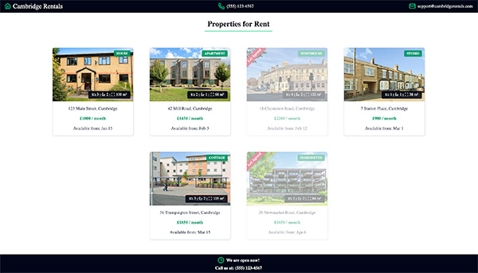

# Cambridge Rentals

A responsive property-rental listing interface built with React, TypeScript, Vite, CSS Modules, and Lucide icons.



[View the live app](https://phayze2184.github.io/cambridge-rental/)

## Features

- Renders property cards from typed listing data
- Shows property type, image, bedrooms, bathrooms, floor area, address, rent, and availability date
- Displays a “Let Agreed” overlay for unavailable properties
- Uses reusable presentational components and CSS Modules
- Uses Lucide React icons for property attributes

## Tech stack

- React
- TypeScript
- Vite
- CSS Modules
- lucide-react

## Getting started

### Prerequisites

- Node.js 20+
- pnpm

### Install and run

```bash
pnpm install
pnpm dev
```

## Available Scripts

```bash
pnpm dev       # Start the development server
pnpm build     # Type-check and create a production build
pnpm lint      # Run ESLint
pnpm preview   # Preview the production build locally
```

## Project Structure

```text
src/
├── assets/images/       # Property images
├── components/          # Reusable UI components
├── data/properties.ts   # Typed property listing data
├── styles/tokens.css    # Global design tokens
├── App.tsx              # Application composition
└── main.tsx             # React entry point
```

## Styling

Components use CSS Modules to scope class names to their components and prevent class-name collisions. Shared colours and design tokens are defined in `src/styles/tokens.css`.

## Property Data

Property listings are stored in `src/data/properties.ts`. Each listing follows the `Property` TypeScript interface, which keeps card data consistent across the application.
